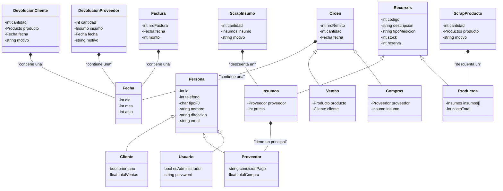

```mermaid

classDiagram
    class Fecha{
        -int dia
        -int mes
        -int anio
    }
    class Persona {
        -int id
        -int telefono
        -char tipoFJ
        -string nombre
        -string direccion
        -string email
    }
    class Usuario{
        -bool esAdministrador
        -string password
    }

    class Proveedor {
        -string condicionPago
        -float totalCompra
    }

    class Cliente {
        -bool prioritario
        -float totalVentas

    }

    Persona <|-- Cliente
    Persona <|-- Proveedor
    Persona <|-- Usuario

    class Recursos{
        -int codigo
        -string descripcion
        -string tipoMedicion
        -int stock
        -int reserva

    }

    class Insumos{
        -Proveedor proveedor
        -int precio
    }
    Insumos *-- Proveedor : "tiene un principal"
    class Productos{
        -Insumos insumos[]
        -int costoTotal
    }
    class Orden{
        -int nroRemito
        -int cantidad
        -Fecha fecha
    }
    Orden *-- Fecha : "contiene una"
    class Ventas{
        -Producto producto
        -Cliente cliente
    }
    class Compras{
        -Proveedor proveedor
        -Insumo insumo
    }

    class DevolucionCliente{
        -int cantidad
        -Producto producto
        -Fecha fecha
        -string motivo
    }
    
    class DevolucionProveedor{
        -int cantidad
        -Insumo insumo
        -Fecha fecha
        -string motivo
    }
    DevolucionCliente *-- Fecha : "contiene una"
    DevolucionProveedor *-- Fecha: "contiene una"
    class ScrapInsumo{
        -int cantidad
        -Insumos insumo
        -string motivo
    }
    class ScrapProducto{
        -int cantidad
        -Productos producto
        -string motivo
    }
    ScrapInsumo *-- Insumos : "descuenta un"
    ScrapProducto *-- Productos : "descuenta un"
    class Factura{
        -int nroFactura
        -Fecha fecha
        -int monto
    }
    Factura *-- Fecha : "contiene una"
    
    
    Orden <|-- Ventas
    Orden <|-- Compras

    Recursos <|-- Insumos
    Recursos <|-- Productos
    
```